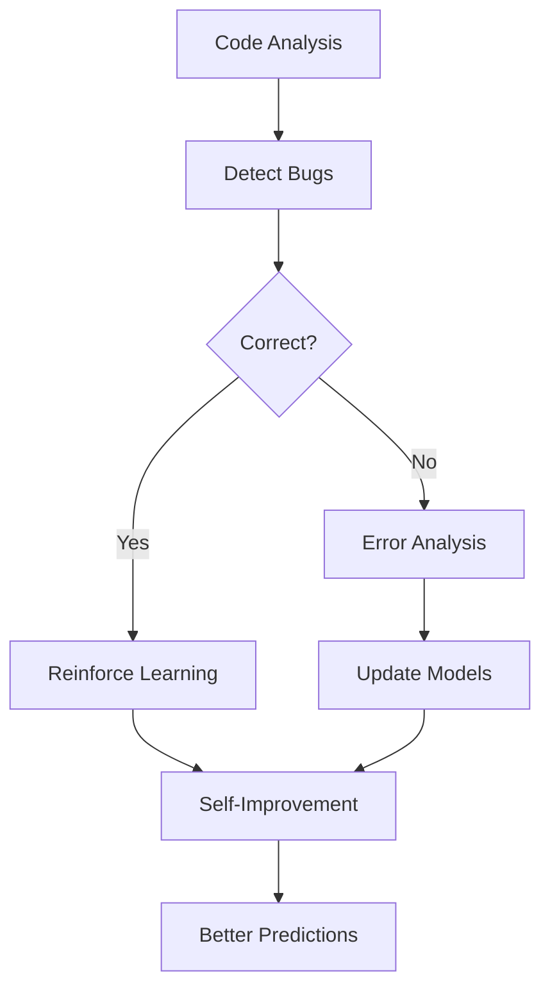

# BugBuster AI - Advanced Code Bug Detection System

## Overview
BugBuster AI v2.0 is an enhanced system combining Parallel AST Processing, Knowledge Graph, Neural-Guided MCTS Search and Transformer-based models for superior bug detection.

## What's New in v2.0
- **Parallel Processing**: 2-4x faster analysis with parallel AST parsing
- **Type Inference**: More accurate detection with type-aware analysis
- **Persistent Knowledge Graph**: SQLite-backed storage for incremental analysis
- **Transformer Models**: State-of-the-art bug prediction and fix generation
- **Learning System**: Self-improving models through experience and error analysis

## Current Implementation Status
The enhanced v2.0 framework includes:
- ✅ Parallel AST parser with enhanced type inference and bug detection
- ✅ Persistent Knowledge Graph with incremental updates
- ✅ Neural-Guided MCTS search with parallel simulations
- ✅ Transformer-based neural models with learning capabilities
- ✅ Optimized CLI interface
- ✅ Comprehensive test coverage
- ✅ Advanced bug detection patterns (50+ bug types)

## Key Features
- **Parallel Code Analysis**: Multi-threaded processing for large codebases
- **Type-Aware Detection**: Variable type inference for better accuracy
- **Incremental Analysis**: Only re-analyze changed code portions
- **Neural-Guided Search**: Transformer models direct bug search
- **Context-Aware Fixes**: Higher quality fix recommendations
- **Persistent Storage**: Maintain analysis results between runs
- **Self-Learning**: Models improve from experience without human intervention
- **Error-Based Learning**: Learns from mistakes to avoid repeating them

## Project Structure
```
BugBusterAI/
├── core/               # Core analysis components
│   ├── ast_parser/     # AST processing (implemented)
│   ├── knowledge_graph/ # Code relationship mapping (implemented)  
│   ├── mcts/           # Monte Carlo Tree Search (basic implementation)
│   └── neural_nets/    # Neural network models (defined)
├── interfaces/         # System interfaces
│   ├── cli/            # Command line interface (implemented)
│   └── ide/            # IDE integration components (structure)
├── tests/              # Test cases (basic tests)
├── requirements.txt    # Python dependencies
└── setup.py            # Project setup
```

## Getting Started
1. Clone this repository
2. Install dependencies: `pip install -r requirements.txt`
3. Run the CLI: `python -m interfaces.cli.main path/to/file.py`

## Example Usage
```python
# Analyze with all v2.0 features
from bugbuster import analyze_code

# For large projects, use incremental mode
results = analyze_code("project/",
                      incremental=True,
                      use_gpu=True)  # Enable GPU acceleration

# Get detailed bug report
bugs = results.get_bugs(severity="high")
for bug in bugs:
    print(f"Bug at line {bug.line}: {bug.message}")
    print(f"Suggested fix: {bug.suggested_fix}")
    
# Save results for next analysis
results.save_knowledge_graph()
```

## Learning Capabilities



The system now features:
1. **Error-Based Learning**:
   - Records prediction mistakes
   - Analyzes error patterns
   - Adjusts models to avoid repeating errors

2. **Self-Learning**:
   - Generates training data from its own predictions
   - Continuously improves through experience
   - Adapts to new code patterns automatically

## Roadmap
- [x] Core framework implementation
- [x] Learning capabilities
- [x] Enhanced bug detection patterns (50+ bug types)
- [ ] MCTS heuristic improvements (in progress)
- [ ] Neural network training pipeline
- [ ] IDE plugin development
- [ ] Multi-language support

## Contributing
1. Fork the repository
2. Create a feature branch
3. Submit a pull request
4. Include tests for new functionality

## License
MIT License (see LICENSE file)